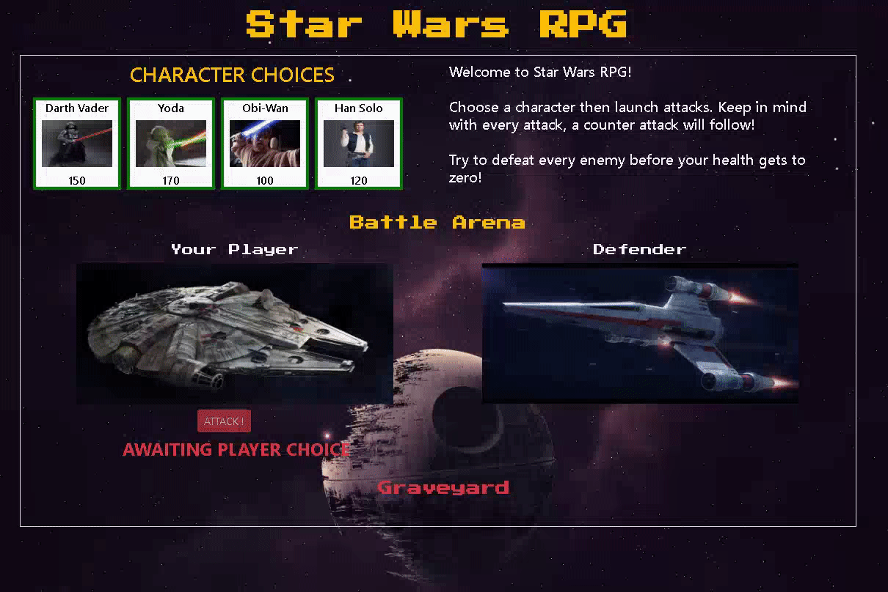

# Star Wars RPG Game

## Description
This project is a web-based role playing game with a star wars theme. I use the frontend library 'jQuery' to handle DOM manipulation.

## Motivation
Having to implement game-logic provided an excellent opportunity to pratice core javascript skills. When coupled with jQuery, managing game - state and player scores was very manageable. 

## Technology used
* HTML
* CSS
* Javascript
* Jquery

## Screenshots

## Resolutions
When developing this game I found it difficult to keep the code organized because I had to store various 'characters' all with very specific properties. I found that using a constructor object to form the framework for each player, creating new objects with specific player values, and then assigning those values to elements using HTML5 'data-attributes' made the code much cleaner and easier to work with. 
 
## Instructions
* Choose a character and then try to defeat all the enemies
* Every attack elicits a counter attack from the enemy
* Every successful attack will double your attack points
* If your score gets to zero then you lose the game

Play it here [Star Wars Game](https://davidlapadula.github.io/unit-4-game/)

